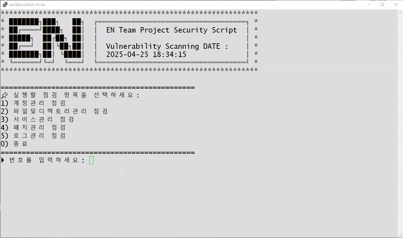

# 🔍 Vulnerability-Scanner-ScriptTeamEN

**주요정보통신기반시설 기술적 취약점 분석 평가 방법 상세 가이드** 기반  
기술적 취약점 진단 자동화 쉘스크립트 프로젝트  

---

## 📌 프로젝트 개요  
이 프로젝트는 **정보통신기반시설을 대상으로 한 기술적 취약점 분석 및 평가**를 목적으로 진행되었습니다.  
주어진 **PDF 자료**(*주요정보통신기반시설_기술적_취약점_분석_평가*)를 바탕으로,  
각 항목에 대해 취약점을 식별하고 위험도를 평가했으며,  
이에 대한 **보안 강화 방안**을 구체적으로 제시하였습니다.  

> 📂 담당 범위: `U25`부터 `U48`까지 구간의 취약점 분석 및 대응 수행  

---

## 🎯 프로젝트 목표  
- 기술적 취약점 분석  
- 위험도 평가 및 우선순위 설정  
- 보안 대응 방안 수립 및 제안  

---

## 🧑‍💻 주요 역할  
- `U01` ~ `U24` 구간 내 취약점 탐지 및 분석  
- 위험도 기준에 따른 우선 대응 항목 도출  
- Shell Script 기반의 진단 자동화 스크립트 작성  
- Markdown 형식의 보안 리포트 작성  

---

## 🛠️ 사용 기술  
- **보안 진단 도구**: `Nmap`, `Nessus`, `OpenVAS`  
- **스크립트 언어**: Shell Script  
- **문서화**: Markdown  

---

## ⭐ 주요 성과  
- ✅ 기존 진단 체계에서 누락된 취약점 다수 식별  
- ✅ 실행 가능한 보안 강화 방안 제시  
  - 시스템 및 네트워크 패치  
  - 접근 통제 설정 강화  
  - 인증 및 권한 관리 체계 고도화  
- ✅ 자동화 스크립트 작성 → 반복 작업 최소화 및 진단 효율성 향상  

---

## 🧠 결론  
본 프로젝트를 통해 **정보통신기반시설의 보안 수준 향상**에 실질적인 기여를 했으며,  
취약점 분석, 위험도 평가, 자동화 및 문서화 역량을 강화할 수 있었습니다.  
이 경험은 향후 보안 프로젝트 수행 시 보다 **빠르고 체계적인 대응**의 기반이 될 것입니다.
